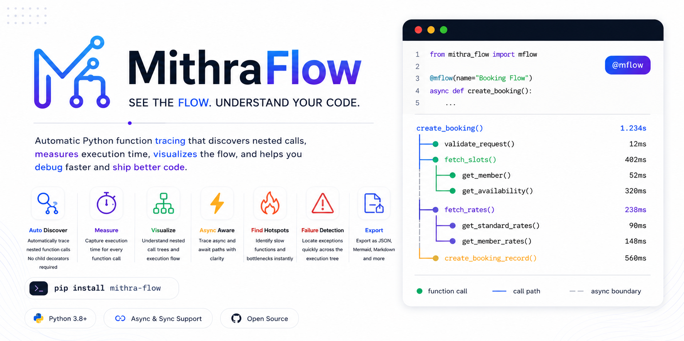
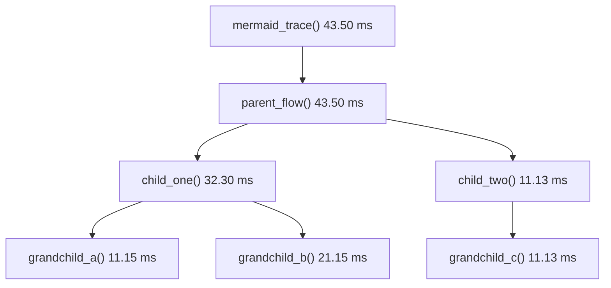

# mithra-flow

[](https://pypi.org/project/mithra-flow/)
[](https://pypi.org/project/mithra-flow/)
[](https://github.com/MITHUNMITS/mithra-flow/actions/workflows/test.yml)
[](LICENSE)




`mithra-flow` is a terminal-first Python tracing decorator. It shows the nested function calls executed inside one sync or async entry point, with timings, filters, manual spans, and export formats.

It is designed for debugging and code-flow understanding, without adding a web UI, database, agent, or framework integration.

```text
──────── MITHRA FLOW  v1.0 ─────────
● basic_trace()  43.43 ms
┗━━ ● parent_flow()  43.42 ms
    ┣━━ ● child_one()  32.17 ms
    ┃   ┣━━ ● grandchild_a()  11.90 ms
    ┃   ┗━━ ● grandchild_b()  20.25 ms
    ┗━━ ● child_two()  11.24 ms
        ┗━━ ● grandchild_c()  11.23 ms
────────────────────────────────────
```

## What It Does

- Traces sync and async decorated functions.
- Captures nested project-local child function calls with `sys.setprofile`.
- Isolates each trace with `contextvars`.
- Measures duration with `time.perf_counter`.
- Prints a colored Rich tree in the terminal.
- Supports filters, depth limits, duration thresholds, args, return values, errors, JSON, Mermaid, files, manual spans, and context manager traces.

## Project Links

- PyPI: https://pypi.org/project/mithra-flow/
- GitHub: https://github.com/MITHUNMITS/mithra-flow
- Changelog: [CHANGELOG.md](CHANGELOG.md)
- License: [LICENSE](LICENSE)

## Use Cases

`mithra-flow` is useful when you need to understand what your code is doing without opening a full profiler, adding a web UI, or wiring a database.

| Use Case | How It Helps |
| --- | --- |
| Debug complex flows | See the exact nested function path that ran during one request, job, or script execution. |
| Understand a new codebase | New developers can trace one entry function and quickly see the project flow. |
| Check performance hotspots | Durations make slow child calls visible without running a heavy profiler. |
| Compare before and after changes | Run the same function before and after a refactor to check if the call tree or timing changed. |
| Debug async behavior | See nested async calls across `await` points in one readable tree. |
| Investigate API requests | Decorate a FastAPI route and inspect the internal service/helper calls behind that endpoint. |
| Find noisy helper calls | Use `min_duration_ms` and `max_depth` to reduce clutter in large call trees. |
| Explain business logic | Export Mermaid or JSON traces to show how a workflow moves through functions. |
| Review errors faster | Use `on_error=True` to print traces only for failed executions. |
| Trace manual work blocks | Use `span(...)` for database queries, cache writes, external API calls, or other blocks that are not standalone functions. |
| Generate debugging artifacts | Use `save_to="trace.json"` to keep trace data for later review. |
| Teach project architecture | Include trace examples in onboarding docs so new team members see real runtime structure. |

Typical places to use it:

- FastAPI route handlers.
- CLI commands.
- Background jobs.
- Data processing pipelines.
- Test/debug scripts.
- Service-layer functions.
- Async workflows.
- Refactor verification.

## Install

From PyPI:

```bash
python3 -m pip install mithra-flow
```

With FastAPI example dependencies:

```bash
python3 -m pip install 'mithra-flow[examples]'
```

For local development:

```bash
python3 -m pip install -e '.[test,examples]'
```

Run tests:

```bash
python3 -m pytest -q
```

## Size And Performance Notes

The library is intentionally small. The first published wheel is roughly 11 KB, and the source distribution is roughly 12 KB.

Tracing uses `sys.setprofile`, so it is intended for debugging, local development, staging, tests, and targeted diagnostics. For production systems, keep it disabled by default and enable it only for specific routes, jobs, or error investigations.

Useful controls for larger projects:

- `include=[...]` to trace only your app code.
- `exclude=[...]` to hide noisy helpers.
- `min_duration_ms=...` to focus on slower calls.
- `max_depth=...` to keep output compact.
- `MITHRA_FLOW=0` to disable globally.

## Quick Start

```python
from mithra_flow import mflow

def child():
    return "ok"

@mflow
def parent():
    return child()

parent()
```

Output:

```text
──────── MITHRA FLOW  v1.0 ─────────
● parent()  0.04 ms
┗━━ ● child()  0.01 ms
────────────────────────────────────
```

## Async Example

```python
import asyncio
from mithra_flow import mflow

async def child():
    await asyncio.sleep(0.01)
    return "ok"

@mflow
async def parent():
    return await child()

asyncio.run(parent())
```

Output:

```text
──────── MITHRA FLOW  v1.0 ─────────
● parent()  11.20 ms
┗━━ ● child()  11.14 ms
────────────────────────────────────
```

## Decorator Options

| Option | Purpose |
| --- | --- |
| `name="checkout"` | Sets a custom banner title. |
| `title="checkout"` | Alias-style title input. |
| `include=["examples"]` | Trace only matching module/function/path values. |
| `exclude=["grandchild_b"]` | Hide matching module/function/path values. |
| `enabled=False` | Disable tracing for that function. |
| `min_duration_ms=15` | Hide calls faster than the threshold. |
| `max_depth=1` | Limit displayed/exported child depth. |
| `show_args=True` | Show function arguments. |
| `show_return=True` | Show return values. |
| `show_file=True` | Show source file names. |
| `show_line=True` | Show source line numbers. |
| `on_error=True` | Print only when an exception happens. |
| `output="terminal"` | Print a Rich tree. |
| `output="dict"` | Return a trace dictionary. |
| `output="json"` | Return a JSON trace string. |
| `output="mermaid"` | Return a Mermaid graph string. |
| `output="none"` | Collect/save without terminal printing. |
| `save_to="trace.json"` | Write trace output to disk. |
| `return_trace=True` | Return `MFlowResult(value, trace)`. |
| `trace_dependencies=True` | Also trace dependency/library frames such as `.venv` and `site-packages`. Off by default. |

Disable globally:

```bash
MITHRA_FLOW=0 python3 your_script.py
```

By default, `mithra-flow` is code-level only: it ignores frames from `.venv`, `venv`, `site-packages`, `dist-packages`, and `__pypackages__`. This keeps SQLAlchemy, Passlib, FastAPI, and other dependency internals out of the tree unless you explicitly enable `trace_dependencies=True`.

## FastAPI Example

Run the example API:

```bash
python3 -m uvicorn examples.nested_flow:app --reload
```

Open docs:

```text
http://127.0.0.1:8000/docs
```

Or call endpoints directly:

```bash
curl http://127.0.0.1:8000/flow/basic
```

## Example API Map

| Endpoint | Demonstrates |
| --- | --- |
| `/flow/basic` | Default nested async tracing. |
| `/flow/title` | Custom banner title with `name=`. |
| `/flow/args` | Arguments and return values. |
| `/flow/location` | File name and line number display. |
| `/flow/max-depth` | Depth-limited tree. |
| `/flow/min-duration` | Duration filtering. |
| `/flow/json` | JSON trace response. |
| `/flow/mermaid` | Mermaid graph response. |
| `/flow/return-trace` | Return value plus trace data. |
| `/flow/include-exclude` | Include/exclude filtering. |
| `/flow/save-to` | Save trace to `/tmp/mithra-flow-example.json`. |
| `/flow/manual-span` | Manual spans inside a trace. |
| `/flow/context` | Context manager tracing. |
| `/flow/on-error` | Print only when an error happens. |
| `/flow/disabled` | Disabled tracing. |

## `/flow/basic`

Code:

```python
@app.get("/flow/basic")
@mflow(include=["examples"])
async def basic_trace():
    return {"result": await parent_flow()}
```

Call:

```bash
curl http://127.0.0.1:8000/flow/basic
```

Response:

```json
{"result":[["grandchild-a","grandchild-b"],["grandchild-c"]]}
```

Terminal graph:

```text
──────── MITHRA FLOW  v1.0 ─────────
● basic_trace()  43.43 ms
┗━━ ● parent_flow()  43.42 ms
    ┣━━ ● child_one()  32.17 ms
    ┃   ┣━━ ● grandchild_a()  11.90 ms
    ┃   ┗━━ ● grandchild_b()  20.25 ms
    ┗━━ ● child_two()  11.24 ms
        ┗━━ ● grandchild_c()  11.23 ms
────────────────────────────────────
```

## `/flow/title`

Code:

```python
@app.get("/flow/title")
@mflow(name="checkout request", include=["examples"])
async def custom_title():
    return {"result": await parent_flow()}
```

Terminal graph:

```text
────── checkout request  v1.0 ──────
● custom_title()  43.26 ms
┗━━ ● parent_flow()  43.26 ms
    ┣━━ ● child_one()  32.09 ms
    ┃   ┣━━ ● grandchild_a()  10.88 ms
    ┃   ┗━━ ● grandchild_b()  21.18 ms
    ┗━━ ● child_two()  11.16 ms
        ┗━━ ● grandchild_c()  11.15 ms
────────────────────────────────────
```

## `/flow/args`

Code:

```python
@app.get("/flow/args")
@mflow(include=["examples"], show_args=True, show_return=True)
def args_and_returns(amount: int = 100):
    return sync_receipt(amount)
```

Call:

```bash
curl "http://127.0.0.1:8000/flow/args?amount=100"
```

Terminal graph:

```text
──────── MITHRA FLOW  v1.0 ─────────
● args_and_returns()(amount=100)  0.05 ms -> {'amount': 100, 'total': 105.0}
┗━━ ● sync_receipt()(amount=100)  0.03 ms -> {'amount': 100, 'total': 105.0}
    ┗━━ ● sync_price()(amount=100, tax=0.05)  0.01 ms -> 105.0
────────────────────────────────────
```

## `/flow/location`

Code:

```python
@app.get("/flow/location")
@mflow(include=["examples"], show_file=True, show_line=True)
async def file_and_line():
    return {"result": await parent_flow()}
```

Terminal graph:

```text
──────── MITHRA FLOW  v1.0 ─────────
● file_and_line()  43.56 ms  nested_flow.py:75
┗━━ ● parent_flow()  43.55 ms  nested_flow.py:37
    ┣━━ ● child_one()  32.35 ms  nested_flow.py:26
    ┃   ┣━━ ● grandchild_a()  11.14 ms  nested_flow.py:11
    ┃   ┗━━ ● grandchild_b()  21.20 ms  nested_flow.py:16
    ┗━━ ● child_two()  11.19 ms  nested_flow.py:32
        ┗━━ ● grandchild_c()  11.18 ms  nested_flow.py:21
────────────────────────────────────
```

## `/flow/max-depth`

Code:

```python
@app.get("/flow/max-depth")
@mflow(include=["examples"], max_depth=1)
async def max_depth():
    return {"result": await parent_flow()}
```

Terminal graph:

```text
──────── MITHRA FLOW  v1.0 ─────────
● max_depth()  42.98 ms
┗━━ ● parent_flow()  42.97 ms
────────────────────────────────────
```

## `/flow/min-duration`

Code:

```python
@app.get("/flow/min-duration")
@mflow(include=["examples"], min_duration_ms=15)
async def min_duration():
    return {"result": await parent_flow()}
```

Terminal graph:

```text
──────── MITHRA FLOW  v1.0 ─────────
● min_duration()  43.54 ms
┗━━ ● parent_flow()  43.54 ms
    ┗━━ ● child_one()  32.37 ms
        ┗━━ ● grandchild_b()  21.20 ms
────────────────────────────────────
```

## `/flow/json`

Code:

```python
@app.get("/flow/json", response_class=PlainTextResponse)
@mflow(include=["examples"], output="json", show_args=True)
def json_trace():
    return sync_receipt(50)
```

Response:

```json
{
  "name": "json_trace()",
  "duration_ms": 0.03,
  "args": "()",
  "exception": null,
  "is_span": false,
  "children": [
    {
      "name": "sync_receipt()",
      "duration_ms": 0.01,
      "args": "(amount=50)",
      "exception": null,
      "is_span": false,
      "children": [
        {
          "name": "sync_price()",
          "duration_ms": 0.0,
          "args": "(amount=50, tax=0.05)",
          "exception": null,
          "is_span": false,
          "children": []
        }
      ]
    }
  ]
}
```

## `/flow/mermaid`

Code:

```python
@app.get("/flow/mermaid", response_class=PlainTextResponse)
@mflow(include=["examples"], output="mermaid")
async def mermaid_trace():
    await parent_flow()
```

Response:



Rendered shape:

```text
mermaid_trace()
└── parent_flow()
    ├── child_one()
    │   ├── grandchild_a()
    │   └── grandchild_b()
    └── child_two()
        └── grandchild_c()
```

## `/flow/return-trace`

Code:

```python
@app.get("/flow/return-trace")
@mflow(include=["examples"], return_trace=True, show_return=True)
async def return_trace():
    result = await parent_flow()
    return result
```

Response shape:

```json
{
  "value": [["grandchild-a", "grandchild-b"], ["grandchild-c"]],
  "trace": {
    "name": "return_trace()",
    "duration_ms": 43.459,
    "children": []
  }
}
```

## `/flow/include-exclude`

Code:

```python
@app.get("/flow/include-exclude")
@mflow(include=["examples"], exclude=["grandchild_b"])
async def include_exclude():
    return {"result": await parent_flow()}
```

Terminal graph:

```text
──────── MITHRA FLOW  v1.0 ─────────
● include_exclude()  42.71 ms
┗━━ ● parent_flow()  42.70 ms
    ┣━━ ● child_one()  32.33 ms
    ┃   ┗━━ ● grandchild_a()  11.17 ms
    ┗━━ ● child_two()  10.36 ms
        ┗━━ ● grandchild_c()  10.35 ms
────────────────────────────────────
```

`grandchild_b()` still executes, but it is hidden from the trace.

## `/flow/save-to`

Code:

```python
@app.get("/flow/save-to")
@mflow(include=["examples"], save_to="/tmp/mithra-flow-example.json")
async def save_to_file():
    await parent_flow()
    return {"saved_to": "/tmp/mithra-flow-example.json"}
```

Call:

```bash
curl http://127.0.0.1:8000/flow/save-to
cat /tmp/mithra-flow-example.json
```

On macOS, `/tmp/mithra-flow-example.json` resolves to:

```text
/private/tmp/mithra-flow-example.json
```

## `/flow/manual-span`

Code:

```python
@app.get("/flow/manual-span")
@mflow(include=["examples"])
async def manual_span():
    with span("manual database query"):
        await asyncio.sleep(0.01)
    with span("manual cache write"):
        await asyncio.sleep(0)
    return {"ok": True}
```

Terminal graph:

```text
──────── MITHRA FLOW  v1.0 ─────────
● manual_span()  11.54 ms
┣━━ ◆ manual database query()  11.30 ms
┗━━ ◆ manual cache write()  0.22 ms
────────────────────────────────────
```

Manual spans use `◆` instead of `●`.

## `/flow/context`

Code:

```python
@app.get("/flow/context")
async def context_manager():
    with trace("context managed flow", include=["examples"], show_return=True) as traced:
        result = sync_receipt(25)
    return {"result": result, "trace": traced.result}
```

Terminal graph:

```text
──── context managed flow  v1.0 ────
◆ context managed flow  0.12 ms
┗━━ ● sync_receipt()  0.01 ms -> {'amount': 25, 'total': 26.25}
    ┗━━ ● sync_price()  0.01 ms -> 26.25
────────────────────────────────────
```

## `/flow/on-error`

Code:

```python
@app.get("/flow/on-error")
@mflow(include=["examples"], on_error=True)
async def on_error_only():
    try:
        await failing_child()
    except RuntimeError as error:
        raise HTTPException(status_code=500, detail=str(error)) from error
```

Response:

```json
{"detail":"example failure"}
```

Terminal graph:

```text
──────── MITHRA FLOW  v1.0 ─────────
● on_error_only()  0.12 ms ! HTTPException: 500: example failure
┗━━ ● failing_child()  0.10 ms
────────────────────────────────────
```

## `/flow/disabled`

Code:

```python
@app.get("/flow/disabled")
@mflow(include=["examples"], enabled=False)
async def disabled_trace():
    return {"result": await parent_flow()}
```

Response:

```json
{"result":[["grandchild-a","grandchild-b"],["grandchild-c"]]}
```

Terminal graph:

```text
No trace is printed.
```

## Context Manager

Use `trace(...)` when you do not want to decorate a function.

```python
from mithra_flow import trace

with trace("batch job", include=["jobs"]) as traced:
    run_job()

print(traced.result)
```

## Manual Spans

Use `span(...)` to mark work that is not naturally represented by a function call.

```python
from mithra_flow import mflow, span

@mflow
def process():
    with span("database query"):
        query_database()
```

Output:

```text
──────── MITHRA FLOW  v1.0 ─────────
● process()  12.30 ms
┗━━ ◆ database query()  11.80 ms
────────────────────────────────────
```

## Return Trace Data

```python
from mithra_flow import mflow

@mflow(return_trace=True)
def parent():
    return "ok"

result = parent()

print(result.value)
print(result.trace)
```

`result` is an `MFlowResult`:

```python
MFlowResult(value="ok", trace={...})
```

## Versioning

The banner version comes from the installed package version:

```python
from mithra_flow import __version__

print(__version__)
```

Package versions are generated from Git tags.

Examples:

| Git Tag | PyPI Version |
| --- | --- |
| `v1.0` | `1.0` |
| `v1.0.1` | `1.0.1` |
| `v2.0.0` | `2.0.0` |

## Release With VS Code And GitHub

Normal code changes:

1. Make changes.
2. Commit in VS Code Source Control.
3. Push `main` from VS Code.

Publish a new PyPI version:

1. Open the GitHub repository.
2. Go to `Releases`.
3. Click `Draft a new release`.
4. Create a new tag, for example `v1.0.1`.
5. Publish the release.

GitHub Actions will build and publish that tag to PyPI automatically.

Terminal version if you prefer commands:

```bash
git tag v1.0.1
git push origin v1.0.1
```

You do not need to edit `src/mithra_flow/version.py` for every release.
